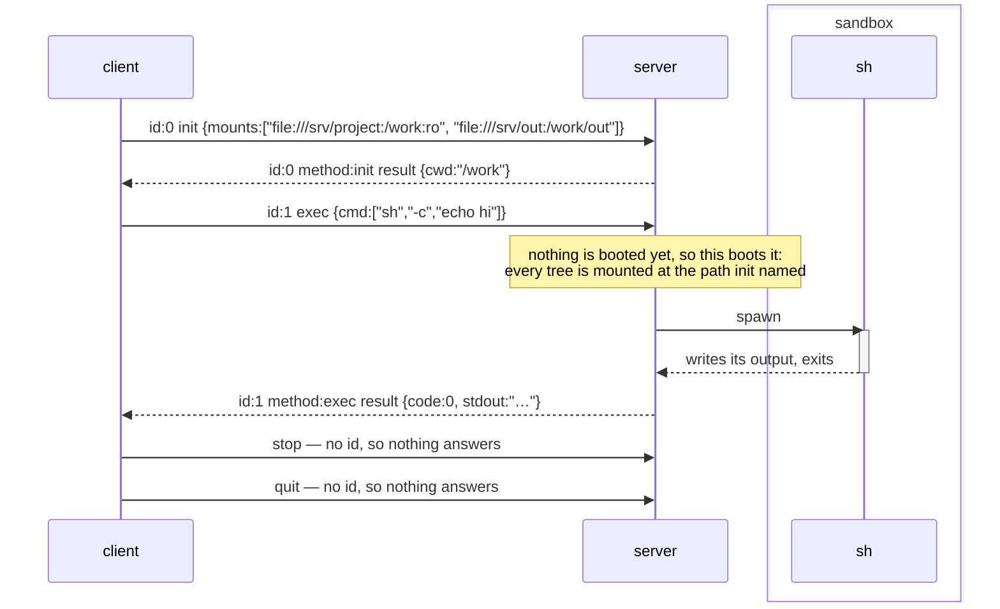
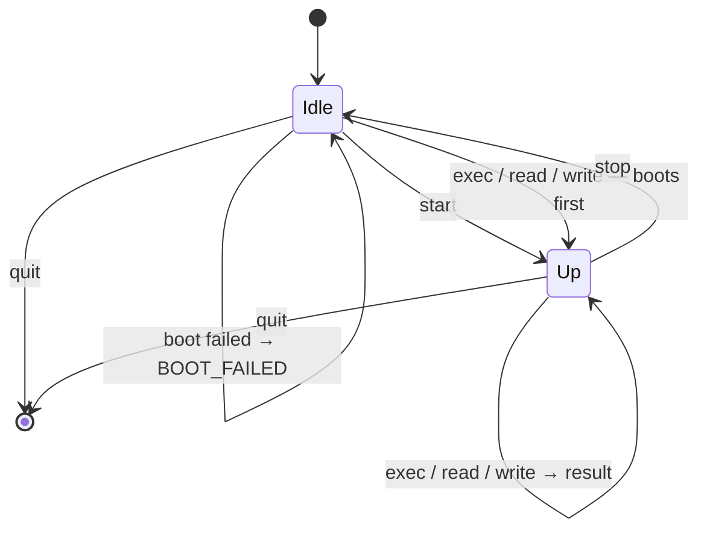

# Headless Console Protocol

How a client drives a console server.
It's *headless* because there is first-intended to bot(e.g. AI agent) usage, rather than human.

Two things make it more than a remote `exec`:

1. JSON-RPC 2.0's object model — the three shapes, the `id` pairing, the error codes — encoded as BSON rather than as JSON text.
   The semantics are the spec's and read as it; the bytes are not, so a peer needs a BSON codec. See [Codec](#codec) for what that trade bought.
2. The session declares its **trees** — a list of mounts, each one a string saying where the tree is, where the session sees it, and whether a command may write in it.
   The client chooses the path a tree appears at, and every path in the protocol after that is spelled under one of those — so a file name means the same thing to a command and to a `read`. See [the trees](#the-trees--what-can-be-reached-and-where-it-goes).

**Each end of the channel does one job.** The client only asks; the server only answers.
There is no request a server ever issues, which is what leaves one channel, one end that asks and one end that answers — see [The channel](#the-channel).

Source: [`message/`](message/) for the objects, [`stdio/channel.rs`](stdio/channel.rs) for the wire, [`base.rs`](base.rs) for what each end can do, [`stdio/`](stdio/) for the ends themselves, [`client.rs`](client.rs) for the public end.

---

## Transport

```
stdin    requests and responses in     ─┐
stdout   requests and responses out    ─┴─ the protocol's, and nothing else
stderr   logs, traces, panics             free-form, for a person
```

The same discipline an MCP stdio server keeps, and for the same reason: stdout *is* the framing channel, so one stray `println!` corrupts the stream rather than merely cluttering it.
It is a rule, not something the types enforce — holding `StdoutLock` for the process would make the mistake a hang instead, but that guard is not `Send`, and the handle is what an end keeps so that a writer can be moved to wherever it is written from.

A command's own stdio never appears here.
It is captured wherever the command runs and travels back inside a `result`, which is what makes one pair of descriptors enough: nothing a command reads or writes needs a descriptor of its own out here.

One pair is also all there is: nothing in this protocol adds a second channel, so this is the whole of its surface.

### Framing

```
[u32 len big-endian][BSON document]
```

A stream of messages has to be cut apart somewhere.
A length prefix says where before any of it is read, so there is no delimiter to search for and therefore none a payload could forge.
`len` is capped at **64 MiB** (`MAX_PAYLOAD`); a frame claiming more is refused rather than allocated, and a zero-length frame is refused because no message serializes to nothing.

Reading distinguishes three outcomes, which is the whole reason for the loop in `fill`:

| | means |
|---|---|
| no bytes before the header completes | the peer closed **between** frames — a clean end |
| bytes, then EOF | truncation — corruption, not an ending |
| header, then `len` bytes | a frame |

> **This header is redundant and kept anyway, for now.**
> It was here because a serialized message did not know its own length.
> A BSON document does — its first four bytes are an `int32`, little-endian, of the whole document including those four — so the header now duplicates what the payload already carries.
> Retiring it would also remove the one layer of this protocol that no peer can guess, which is worth more than the four bytes.
> Not done yet because it is a wire change and the codec swap already was one; `stdio/channel.rs` has what it takes.

---

## Codec

The wire is **BSON**, for two reasons.

**It has to be self-describing.**
`{"method":.., "params":..}` is adjacent tagging and `result` xor `error` is decided by which member is *present*, so a reader must look ahead — which rules out postcard and bincode.
A response echoes the `method` it answers, so a `result` is typed by a member beside it rather than by a table the reader keeps.

**It has to have a byte type.**
A command's output is most of what this channel carries and none of it is text.
JSON has no way to say so, which meant base64 at 1.37× — decoded again at the far end — or `[104,105,10]` at 4×.
BSON has `Binary`, so they travel as themselves.

What it cost is the off-the-shelf JSON-RPC library, which was the reason for JSON.
That is a real capability given up, and worth less than it looks: such a peer already needed bespoke framing (above), and both ends of this channel are in this workspace today.

What it did **not** cost is size where size matters, though the accounting is not one-sided.
BSON is not a compact format — array indices become keys (`["ls"]` is `{"0":"ls"}`) and every name is a C string — so a control frame is *larger* than its JSON spelling:

| frame | JSON | BSON | MessagePack |
|---|---|---|---|
| `exec {"cmd":["ls"]}` | 64 B | 84 B | 46 B |
| a 4 KiB `stdout` | ~5.5 KiB | ~4.1 KiB | ~4.1 KiB |

MessagePack and CBOR beat BSON on both lines and were the real alternatives.
BSON won on two things neither has: its documents are **self-delimiting**, which is what retires the framing header above, and it keeps a readable projection — `doc!` in the tests, Extended JSON for a person — so the wire can still be read member for member.

---

## JSON-RPC 2.0

The object model below is the spec's, member for member. Only the encoding is not — every example is written as Extended JSON would show it, so that the members are legible; `stdout` and `stderr` are `Binary` and not the strings they appear as.

Three object shapes, told apart the way the spec tells them apart — by which members are present, not by a tag we invented.

| present | is |
|---|---|
| `params` (or neither of the two below) + `method` + `id` | a **request** |
| `method`, no `id` | a **notification** |
| `result` xor `error` (+ `id`) | a **response** |

`method` is on a request *and* on a response — see [Where this departs from the spec](#where-this-departs-from-the-spec) — so what tells the two apart is which payload member is present: `params` for a request, `result` or `error` for a response.

Every request gets exactly one response, carrying the same `id`.

### Ids

`id` is a number, allocated by the **client** — the only end that issues requests — counting from zero, by one.
Nothing on the answering side reads a meaning into the number.

There is a single request outstanding at a time.
So what an `id` earns is not concurrency but **certainty about what an answer answers** — a response carrying an id nobody issued is a peer that has lost its place, and it can be dropped instead of being mistaken for the answer that was due.

**Pair by `id`, not by position.**

### Where this departs from the spec

**A response carries the `method` it answers.** JSON-RPC does not: an `id` identifies a response, and the caller is expected to remember what it asked.

That works for a *caller* and not for a *reader*. `{"code":0,…}` and `{"size":10}` are both objects, and nothing in the bytes says which method's answer either one is — so without the member, a response can only be typed by whoever holds an id→method table, and the code that reads frames would have to keep one.

```json
{"jsonrpc":"2.0","id":2,"method":"exec","result":{"code":0,…}}
```

`result` is still exactly the method's own payload, with nothing wrapped around it, so a peer that ignores the extra member reads what it always read.
An `error` carries no `method`, because an error is one type whichever method it answers — which is the whole of the asymmetry.

What this buys is that a response is one self-describing frame: `Response` on the Rust side is a real enum, read the same way by whoever is holding it, and neither end keeps state to make sense of what arrived.

### What is refused when reading

- `jsonrpc` missing, or not exactly `"2.0"`
- an unknown `method`
- `params` that are not what the method takes
- a request with no `id`; a notification — `start`, `stop`, `quit` — **with** one
- `result` and `error` together, or neither
- a `result` with no `method` to type it, or one that is not what that method answers with
- `params` and a `result` together — a message trying to be both a request and a response
- `method` together with `result` or `error`

Unknown members are **ignored**, so a peer may add `trace_id` without breaking us.
Member order is free — `params` may arrive before the `method` that types it.

---

## Methods

| method | `params` | `result` |
|---|---|---|
| `version` | - | `{version}` |
| `build_image` | `{recipe, ref?}` | `{ref, digest}` |
| `remove_image` | `{image}` | `{}` |
| `list_images` | `{}` | `{images}` |
| `init` | `{image?, snapshot?, network?, ports?, vcpus?, memory_mib?, gpu?, gpu_memory_mib?, disk_gib?, mounts?}` | `{cwd?}` |
| `exec` | `{cmd, timeout_ms?}` | `{code, stdout, stderr, truncated}` |
| `read` | `{path, offset?, len?}` | `{data, size}` |
| `write` | `{path, data?, offset?}` | `{size}` |
| `snapshot` | `{}` | `{blob}` |
| `start` | — | *(notification)* |
| `stop` | — | *(notification)* |
| `quit` | — | *(notification)* |

**Every method is the client's.**
The channel runs one way: the client asks and never answers, the server answers and never asks.
There is no method a server issues — see [The channel](#the-channel).

`params` is omitted entirely for a method that takes none: the spec allows leaving it out, and `null` is not one of the two types it permits.

### Booting is not a method

**Anything that needs a booted session boots one.**
An `exec`, a `read`, a `write` and a `snapshot` are each served by a server that brings the session up first if it is not up already — so `start` and `stop` are entirely optional, and a client that sends neither runs the same commands to the same results.

That leaves the pair as **this protocol's resource management, and nothing else**.
Neither unlocks anything; both are about what the far end is *holding*, and when it paid to hold it.

| | what it is for |
|---|---|
| `stop` | **give occupancy back.** A booted session is a guest's memory, a mounted tree and a scratch directory on the far end, useful only while something is running. A client that knows it is going idle hands them back. |
| `start` | **hide the cold start.** A backend with a kernel to bring up otherwise makes the first command pay for that inside its own latency. A client that sends this as soon as it has a console pays for it in parallel with whatever it does next — choosing what to run, waiting on a model, reading a file — and the command that follows finds the session already up. |

The two are the same trade in opposite directions, and the cost of a `stop` is the `start` that will have to happen again — so it is worth sending when the idle stretch is long and not when it is two commands apart.

That is also what makes them notifications: neither is a question.
A session that failed to boot and one that has not booted yet behave identically, since the next call that needs one tries again, so there is no answer a client would act on.
A boot that fails is reported to whoever asked for the call that needed it, as `BOOT_FAILED`.

`init` is the exception, and it is a call, because it is not about resources at all.

### `init` — this is the session

```json
{"jsonrpc":"2.0","id":0,"method":"init","params":{"mounts":["file:///srv/project:/work:ro","file:///srv/out:/work/out"]}}
{"jsonrpc":"2.0","id":0,"method":"init","result":{"cwd":"/work"}}
```

What a session is: **what can be reached**.
It outlives any one execution, which is why it is here and not on an `exec` — it has to be in place before the first command that uses it, so it is said once instead of on every command.

The other thing a session *has* is where it stands, and that is the server's to keep rather than the client's to say — so it is not in the request at all, and the answer is the first reading of it.

It is also the only method whose answer carries anything, and what it carries is the one fact the client could not have worked out from what it sent: a client that has not been told where the session stands cannot say where a command would look.
Where the trees went is not in it, because the call already said — see below.

#### The trees — what can be reached, and where it goes

A list, in the order they are mounted, each one a string.

```json
→ {"mounts":["file:///srv/project:/work:ro","file:///srv/out:/work/out"]}
← {"cwd":"/work"}
```

```text
<host url>:<guest path>[:<option>]…
```

| part | is |
|---|---|
| host url | where the tree is, on the side that holds it — the kind is the scheme |
| guest path | where it appears to the session's commands; absolute, and the client's to choose |
| option | `ro` — the session reads this tree and does not write in it; `rw` is the default and is sayable |

**One string, because a mount is one fact.**
It is also the spelling a reader already has: `mount`, `fstab` and every container runtime say a source, a destination and a list of options in this order.
An object of three members would be the same three facts spread over a shape that has to be built before it can be said, and a wire schema that grows a member every time a mount gains an option.

It is read from the right — trailing segments that are options are options, the first segment from the right beginning with `/` is the guest path, and everything before it is the URL.
Which is what lets a URL carry a colon of its own (`https://example.com:8080/share:/work`) without quoting, and what the two rules above cost: the guest path is absolute and carries no colon.

**What a tree is *for* is the client's and is not on the wire.**
A project to read and a directory to leave output in are two entries differing in their URL, their guest path and their `ro`, and that is the whole of what a server has to know to realize either.
A member per purpose would be the same three facts under a name that changes none of them, and would cap a session at the purposes this file happened to enumerate.

So the arrangement worth having is the client's to build, and this one is worth having: a session given somebody's project `ro` and a writable tree beside it leaves the caller a tree whose whole contents are the result, rather than a diff against a directory somebody else may also be writing to — and on a backend where the project is a store expensive or unwise to write to, that is a question with no other good answer.

**`ro` is per tree, because read-only-ness is a property of the mount and not of the tree's purpose.**
It is enforced rather than merely meant: a `write` naming a path under an `ro` mount comes back `-32007`, the code a read-only filesystem answers one with.
How far that reaches is the backend's, because this protocol mounts nothing.
A backend with a kernel of its own mounts the tree `MS_RDONLY` and every write into it fails, a command's included.
A backend that runs commands on the host has nothing mounted to be read-only, so it answers for the `write` calls it performs itself and leaves a spawned command the reach the host gives it — which is the same thing that makes the host backend's paths a place to stand rather than a confinement.

**Room to work in is not one of them.**
A session already stands on a filesystem it may write to and that goes away with it, so a command that unpacks an archive or builds something has somewhere to put it without the client naming a tree for it — and a tree named for that would be one more thing to mount, place and answer for, in exchange for what the session's own root already gives.

That is a different question from the one [`fs`](../fs/ARCHITECTURE.md) answers by composing many stores behind one URL, and both answers stand: several stores under one root are one namespace a command walks, where these are separate namespaces the client places itself.
So a session that needs five project directories *in one tree* still composes them behind one URL, and one that wants them at five paths writes five entries.

An empty list is nothing mounted, and that is not an error — a client with no tree is still a client, and then the member is left off the frame rather than sent empty.
Such a session's commands see whatever the executor's own filesystem holds, and this protocol has described none of it.

**The scheme is the kind.**

| scheme | is |
|---|---|
| `file:///srv/project` | a directory in a filesystem the server can already open |
| `http://…`, `https://…` | a tree reached over HTTP — on the wire, implemented nowhere |

A `file://` URL is usually a directory the *client* put there: a virtx tree mounted in front of a kernel on this host, whose path is then the whole of what the server has to be told about it.

A URL and not a tagged object, because there is one thing this protocol does with it: hand it to whatever realizes that kind.
A tagged object would grow the wire schema with every provider anyone adds; a string leaves the schema alone and leaves each kind's spelling to the kind — so a peer that has never heard of a scheme still parses the frame, and refuses it for the reason it actually has.

That reason is [`UNSUPPORTED_MOUNT`](#errors), and unlike the failures below it is **`init`'s own**.
Which kinds a server can realize is a fact about the build, knowable the moment the frame is read — and taking a session whose tree can never be there would make every later path under it a lie.
One code for every entry, with the *message* naming which: a session's trees are a list the client wrote and not a set of members this file enumerates, so there is no fixed name to give each of them a code, and what a client does about it is the same either way.

A URL is a name, so a kind that has to be authorized rather than opened will need somewhere to carry that; `file://` needs none, which is why there is nowhere yet.
Whatever it becomes will cross in the clear, and what protects it is the transport: over stdio, a pipe to a child on this host.

**The guest path is the client's, and it is what the rest of the protocol speaks.**
A `read` names a file under one, and so does a `write`.
Nothing is workspace-relative and nothing is rewritten in flight.

That is the trade this part of the string exists to make. The other way to have a name mean one file is for the server to place each tree and answer where it put it, which is a round trip, a member on the response, and a client that holds a tree it cannot yet name a file in.
Saying it in the call costs the client the choice of a path that has to work on the far side — an absolute path the server can mount at — and buys that every path in the session is settled before `init` goes out.
A backend whose commands run somewhere else — a guest, a container — mounts each tree at the path it was given and relays every later path untouched, so a `pwd` a command prints, a path a `read` carries and what the client wrote at `init` are one string, and nothing anywhere rewrites a path.

A client that also wants to reach those files *itself* already can, and not through this protocol: it mounted the tree, so it has its own name for the same directory — the mount point behind the URL it sent.
The two names never have to meet, because only one of them is ever in a frame.
This is what [`ConsoleClient`](client.rs) keeps apart by holding both: the mount it was handed, and the guest path it named.

**One spelling, and it is this one.**
Every path that comes out of a session afterwards has to be spelled the way the call wrote it, because the client's only way to relate one to the other is the characters — including what a command's own `pwd` prints, which is a path a client will turn around and send back in a `read`.
That is not automatic and it is where a backend will get it wrong: `getcwd(2)` answers the *physical* path, so a tree mounted at `/var/x` is seen from inside as `/private/var/x`, and a `cd` that canonicalized would land there too. Both are the same directory and neither is one the client named.
So a server holds the spelling it was given and puts what it observes back into it. `virtx-local-console` does this in two places, and both were bugs before they were code.

**Nothing is mounted by sending it**, any more than anything is booted by it.
The guest path is where the tree *will be*: the mount happens when the session boots, so a client holding a path holds a name before it holds a directory.
Nothing needs it any sooner — a `read`, a `write` and an `exec` each boot a session first.
A mount that then fails is [`MOUNT_FAILED`](#errors) to whoever asked for the call that needed it, exactly as a boot that fails is `BOOT_FAILED`.

The path is fixed for the session either way, which is what makes it usable as a name: a `stop` takes the mount down and the next call puts it back at the same place.

**In order**, and the order is what puts one tree inside another: a server realizes them as they are written, so a mount at `/work/out` following one at `/work` lands inside it, and the two written the other way round do not.
Two entries at the same path, or one at a path this server cannot use, are a malformed request — `-32602`, because the request is what has to change rather than the build.

What the kinds are and how one tree is assembled from several stores is [`fs/ARCHITECTURE.md`](../fs/ARCHITECTURE.md); this protocol carries a URL, a path and whether it may be written.

#### The network — on or off, and the ports in

```json
"network": true,
"ports": ["8080:80", "5901:5900"]
```

`network` is whether a session's commands reach a network at all, and is on when left out: on is the one value every server can give.
On is what a process on the server's machine reaches, less that machine's own loopback: the services listening there are the operator's, not the session's.
Off is no network at all.
There is nothing between the two, because a level between them is a firewall every backend would have to reimplement, and the server's machine is already the place that knows how to keep a process off part of a network.

`ports` are the ways *in*, each spelled the way docker's `-p` spells it — host first, both numbers always: `"8080:80"` is a listener at `127.0.0.1:8080` on the server's machine that reaches port 80 in the session.

- **Loopback, and TCP.** A port is a service on the server's own machine, never one on its interfaces, so there is no address in front of it and no `/udp` after it.
- **The host port is the client's to choose**, so there is nothing for the result to answer: the port a client connects to is the one it wrote. One that is taken on the server's machine is refused with `-32602`, while the client can still pick another.
- **A port is the session's, not a boot's.** It is held from `init` to `quit`, across every `stop` and the boot after it. A connection that arrives while nothing is booted waits for the next boot.
- **A connection reaches whatever in the session listens on that port**, whichever address it listens on, and is closed when nothing does.

A port on a session with `network: false`, and a port of `0` on either side, are refused with `-32602`.

#### The machine — how big it is, whether it has a GPU, and how much it may write

```json
→ {"vcpus":4,"memory_mib":4096,"gpu":true,"gpu_memory_mib":8192,"disk_gib":32}
```

| member | is |
|---|---|
| `vcpus` | how many vCPUs the session's machine gets |
| `memory_mib` | how much memory it gets, in mebibytes |
| `gpu` | whether its commands get an accelerator |
| `gpu_memory_mib` | how much memory that accelerator may hold, in mebibytes |
| `disk_gib` | how much its commands may write, in gibibytes |

Here and not on an `exec` for the reason the trees and the network are: a machine is made before the first command and outlives the last one, so on a backend with a kernel of its own all of them are fixed before that kernel starts.
A number on an `exec` could only be honoured by making a different machine out from under the command that asked for it.

**What is asked for is what is given.**
A server makes the machine that was named or refuses the session — it does not quietly make a smaller one.
A session given two vCPUs where it asked for eight, or no accelerator where it asked for one, is not a narrower session: it is a client drawing conclusions from how long its commands took, about a machine nothing ever told it the shape of.
A shape this server cannot make is [`UNSUPPORTED_MACHINE`](#errors), said at `init` while the client can still ask for something else, and apart from `BOOT_FAILED` because asking again will not make it true.

**Each member is separately optional, and leaving one out is the common case.**
Absent is not a default this file names — it is the server's own, which is the only end that knows what the host it runs on has to spare.
So a client with an opinion about memory and none about the rest sends one member, and the machine is otherwise whatever that server makes.

**The unit is in the name**, because a number this size implies none: bytes, MiB and GiB are all readings of `2048` a person could have meant, and two of them are a machine a thousand times the one that was asked for.
`timeout_ms` is the same member of the same family.
A `vcpus` or a `memory_mib` of `0` is a machine nothing runs on, and is `-32602` rather than a second spelling of leaving it out.

**`gpu` is a boolean and not a device name.**
What this protocol can hold a server to is that a command finds an accelerator, not which one: the device is the backend's — a virtio-gpu carrying Vulkan on one, whatever the host has on another — and a member naming a model or an API would be a promise only that backend's build could keep, on a wire schema that grew with every vendor.
A session that needs a particular device asks the session, since the command that would use it is the end that can see what is there.

`false` is a session that must not have one, which is not the same as saying nothing: a device, a renderer and the boot time they cost are worth declining on a backend that would otherwise attach one.

**`gpu_memory_mib` is beside `memory_mib`, not a share of it.**
What an accelerator holds is memory of its own on one backend and the host's on another — on a GPU that shares the host's memory, every buffer a command maps is host memory the machine's RAM does not count — so a session that fills both has taken the two together, and a client sizing a session against a host adds them.
It is given as asked and it is what the commands see: the device they enumerate reports this much, so a program that sizes itself to the device it finds fits in what it was given, rather than finding out at the allocation that fails.
A size a server cannot give is `UNSUPPORTED_MACHINE`.
It describes an accelerator, so beside a `gpu` of `false` — or of nothing, on a server that gives none — it is a malformed request, `-32602`; and `0` is too, for the reason a vCPU count of zero is.
Memory is a property every accelerator has, which is why this member does not break the rule the boolean keeps: it names no model and no API.

**`disk_gib` is room for writes, not the size of the image.**
What the base ships is not counted; what is bounded is everything the session adds on top of it — the files its commands create or change, and a `snapshot` handed back at `init` along with them — and a command that writes past it finds a full disk.
It is a ceiling and not an allocation: a server need not set the space aside up front, so a session that asks for more room than it fills costs the host what it wrote.
Gibibytes rather than the mebibytes memory is said in, because a mebibyte is too fine a step to mean anything for a disk.
A size a server cannot give is `UNSUPPORTED_MACHINE`, and `0` is `-32602`, for the reason a vCPU count of zero is.

There is no member for what a *command* gets — a share of the machine, an affinity, a limit.
The machine is the unit this protocol hands out, and a session that wants two sizes of it is two sessions.

**Nothing is booted by it**, and the response is not a readiness signal — it is the one thing about a session a client can hear before it asks for work: that there is a server on the far end, that it read the frame, that it speaks this protocol, and that it has taken what it was told.
A notification could say none of that, which is the whole reason this one method is answered.

Which is also why the asking side sends it when a console is *constructed* rather than leaving it to a caller to remember: a `ConsoleClient` that exists is one that got this answer back. See [Session](#session).

A second `init` replaces the first and takes whatever was booted under it with it.
The trees are built into what booting produced — a mounted tree apiece — so a session that changes them has a boot that no longer matches it; the next call that needs one builds it again, from what has just arrived.

### `start` — boot now, to hide the cold start

```json
{"jsonrpc":"2.0","method":"start"}
```

No `id`, no response, and nothing that has to send it.
It unlocks nothing and buys only who waits for the boot — see [Booting is not a method](#booting-is-not-a-method).
Sent to a session that is already booted, it does nothing.

### `exec` — run this

```json
{"jsonrpc":"2.0","id":2,"method":"exec","params":{"cmd":["sh","-c","echo hi"],"timeout_ms":5000}}
{"jsonrpc":"2.0","id":2,"method":"exec","result":{"code":0,"stderr":{"$binary":{"base64":"","subType":"00"}},"stdout":{"$binary":{"base64":"aGkK","subType":"00"}},"truncated":false}}
```

Minimal form — no timeout of its own:

```json
{"jsonrpc":"2.0","id":2,"method":"exec","params":{"cmd":["ls"]}}
```

| field | |
|---|---|
| `cmd` | the command, already split into argv. Nothing consults a shell, so quoting and word rules stay wherever the command was composed; a caller that wants shell semantics asks outright — `["sh","-c","…"]`. Empty is `INVALID_PARAMS`. |
| `timeout_ms` | a **kill** on expiry: no grace period, no second signal, no negotiation. |
| `code` | the command's exit status; `128 + signal` when a signal killed it. |
| `stdout`/`stderr` | `Binary`, byte-exact, kept apart. |
| `truncated` | the command wrote more than the executor would hold, and this is the beginning of it. |

The `result` **is** the ending — the members above, with nothing wrapping them.

That is also the extension point, and the reason there is no wrapper: what a backend has to say about an execution later is a new *member*, which every reader here already ignores when it does not know it. A tagged alternative beside the ending — `{"suspended": …}` next to a `{"done": …}` — would instead be a shape an older peer could only fail on, so the spelling that looks more future-proof is the one that is less.

**And it describes the command, not the machine.** Nothing here says where the execution ran or where it left the session; see [Where the session stands](#where-the-session-stands) for why that is a question a client asks rather than an answer every result repeats.

#### Output

`stdout` and `stderr` stay apart because merging is something a requester can do and un-merging is not.
The interleaving between them is not preserved: two buffers are not one stream, and a caller that needs the order asks the command for it (`2>&1`).

`truncated` exists because silence would be worse than shortness.
A result travels in one frame under `MAX_PAYLOAD`, so an unbounded writer has to be cut off somewhere, and an agent reading output it does not know is partial will draw a conclusion from it.

**Bytes, not text.**
`stdout`, `stderr` and a file's `data` cross as BSON `Binary`, subtype `Generic` — at 1.0×, and byte-exact whether or not the output was ever UTF-8, which routinely it was not.
Getting this is the second half of [why the codec is BSON](#codec): JSON had no byte type, so the same payloads had to be base64 (1.37×) to avoid being `[104,105,10]` (4×).

The `bytes` helper no longer asks the codec whether it is human-readable, and that is deliberate rather than a simplification.
`params` and `result` pass through a `Bson` value before reaching the wire — they must, since a `result` is typed by a method only the caller knows — and `bson`'s value-level serializer reports itself human-readable.
Asking would therefore re-encode base64 at exactly the point the byte type was the point, and nothing on the wire would show it had happened.
`message/method/mod.rs` holds the reasoning; a test asserts on the frame's bytes rather than on a round trip, because a round trip passes either way.

#### Where the session stands

A session has a current directory, and **the far end is what keeps it**.

```json
{"jsonrpc":"2.0","id":0,"method":"init","result":{"cwd":"/work"}}
{"jsonrpc":"2.0","id":2,"method":"exec","params":{"cmd":["cd","work"]}}
{"jsonrpc":"2.0","id":2,"method":"exec","result":{"code":0,"stdout":…,"stderr":…,"truncated":false}}
{"jsonrpc":"2.0","id":3,"method":"exec","params":{"cmd":["ls"]}}
```

The `ls` lists `/work/work`, and nothing in any of these frames said so.
`init` answered where the session started — the working directory the base image declared, because the image is what the session runs on and a tree the client *gave* the session is not a place to drop everything a command writes — the `cd` moved it, and the next command inherited that — which is the whole of the mechanism: **a server is a state machine, and `init`'s answer is the only reading of it a client is given.**

#### Nothing reports the move, and `pwd` is why

A `cd` is answered with a code and no output, exactly as a terminal answers one.
A person at a shell is not told the directory after every command; they type `pwd` when they want to know, and a client is in the same position — `pwd` is an `exec` like any other, and it answers in the session's own spelling because the backend hands the command a matching `PWD`.

The alternative is a `cwd` member on every result, absent on nearly all of them because nearly no execution moves anything.
That is a member a reader stops looking at, and the one time it matters is the one time it can simply be asked for.
What it costs is a round trip on the executions where a client actually needs the answer; what it buys is a result that describes the *command* — what it wrote, how it ended — and nothing about the machine it ran on.

#### What moves it

**A command's effect on it is the server's to work out, not the protocol's to define.**
`cd` in a child process dies with that process, so a backend that spawns each command and reads nothing back is one whose sessions never move — a legal server, and simply a poorer terminal.
A backend that keeps a shell, or interprets `cd` itself as both of the ones here do, moves the session and the next command starts there.

**Why the request carries no directory.**
A per-`exec` `cwd` would be a second answer to a question that already has one, and the two would disagree the moment a command ran `cd`: the client would be instructing where to run while the server was tracking where it *is*.
One of them has to be authoritative, and it can only be the end that watches the commands.

What that costs is that a client cannot run one command somewhere else without moving the session to get there — `sh -c 'cd elsewhere && …'`, and back again if it cares.
That is the trade, and it is worth taking: a shell has the same one, and an agent driving this reads its own transcript the way a person reads a terminal.

### `read` — hand back part of a file

```json
{"jsonrpc":"2.0","id":5,"method":"read","params":{"path":"/work/out/log.txt","offset":4096,"len":1024}}
{"jsonrpc":"2.0","id":5,"method":"read","result":{"data":{"$binary":{"base64":"aGkK","subType":"00"}},"size":10000}}
```

The path is one in the executor's own filesystem, built by joining onto what `init` answered with, so it names the file a command would open by the same name.
A relative one lands [where the session stands](#where-the-session-stands), which is the same rule a command's relative path follows — and the reason to send an absolute one anyway is that the session moves and a client that built the path is the end that knows what it meant.

| field | |
|---|---|
| `path` | UTF-8, and the executor's own. |
| `offset` | where to start; omitted is the beginning. Past the end is not an error — the answer is empty `data` and the `size` that says so. |
| `len` | how many bytes at most; omitted is as many as there are. |
| `data` | `Binary`, byte-exact. |
| `size` | the **file's** size, not `data`'s length. |

`size` is what makes a bounded read usable.
One frame holds the answer, so a file larger than `MAX_PAYLOAD` comes back in pieces and the executor hands back less than `len` asked for when the rest would not fit.
Comparing what arrived against `size` is the only thing that says there is more, and asking again from further along is how to get it — a reader that ignores it cannot tell a whole small file from the front of a large one.

### `write` — put these bytes in a file

```json
{"jsonrpc":"2.0","id":6,"method":"write","params":{"path":"/work/in/data","data":{"$binary":{"base64":"aGkK","subType":"00"}}}}
{"jsonrpc":"2.0","id":6,"method":"write","result":{"size":3}}
```

| field | |
|---|---|
| `path` | as `read`'s. Any directory above it has to exist; the file itself does not. |
| `data` | `Binary`. Omitted is empty, which for a whole-file write means an empty file. |
| `offset` | omitted **replaces** the file — created if it was not there, cut to length if it was. Present **overwrites** from there and leaves whatever lies past the bytes written, extending the file with zeroes if it is beyond the end. |
| `size` | the file's size afterwards. |

Omitted and `0` are therefore different, and a requester that means to replace a file sends neither: the whole-file case says nothing about what was there before, and the positioned case says nothing about the rest of the file.

A `write` that fails with `IO_FAILED` says nothing about how much of `data` landed.
The file is whatever it is, and a requester that needs to know asks with a `read`.

### `snapshot` — hand back what this session has written

```json
{"jsonrpc":"2.0","id":7,"method":"snapshot","params":{}}
{"jsonrpc":"2.0","id":7,"method":"snapshot","result":{"blob":{"$binary":{"base64":"…","subType":"00"}}}}
```

The other half of `init`'s `snapshot`: what comes back is exactly what that takes, so a session is carried on by opening a new one with `blob` in hand, and it starts with those changes already in place.

| field | |
|---|---|
| `blob` | `Binary`. The session's writes as a layer tar — the files it wrote, with the ones it deleted carried as OCI whiteouts. |

**The bytes are the executor's, not the client's.**
What is in them is that executor's own encoding of the changes, read back only by an executor of the same kind, and a client's part is to keep them and hand them over.
A layer and not an image of the filesystem underneath, because a filesystem image brings its own metadata, its journal and all the room it was formatted to, none of which is the session's work — and a layer is what an executor already knows how to put in front of a base.

**Everything since the session began, not since the last `snapshot`.**
A snapshot is where a session *is*, so two taken in a row give the same thing twice, and the second is not the difference between them.

**One frame, or an error.**
Unlike `read`, it does not come back in pieces: a snapshot is read back as a filesystem, and the front of one is not a smaller session's work but a broken tree.
A session that has written more than `MAX_PAYLOAD` holds is refused rather than shortened.

### `stop` — release what booting took, to stop occupying it

```json
{"jsonrpc":"2.0","method":"stop"}
```

Much what stopping a VM is: the guest goes away, the tree is unmounted, and a scratch directory is cleaned up by whoever made it rather than left for someone to find later.
Those are memory, descriptors and disk held on the far end for as long as the session is booted, and worth holding only while something is running — which is the whole reason a client is given a way to say it is going idle.

Afterwards the session is where it was before it booted, and **the next call that needs a boot gets one** — under the same `init`, with nothing having to ask, and with the tree back at the path that `init` answered with.
So a client that sent a `stop` keeps every path it had built; what changed is only whether anything answers at them in the meantime.

[Where the session stands](#where-the-session-stands) survives it too. A current directory is a `PathBuf`, not occupancy — there is nothing to hand back by forgetting it — and a client that ran a `cd`, went idle and came back would otherwise find itself somewhere it never asked to be.
So a server process outlives the resources it booted, which is what makes handing them back cheap: it costs one cold start later and nothing else.

`ConsoleClient::stop` is therefore not the end of anything and not owed; dropping the `ConsoleClient` is what sends `quit`, and a server on its way out releases what a `stop` would have released.
What `quit` costs to carry out is the transport's — over stdio it also closes the server's stdin and waits for the process, because that client is what started it.

`stop` does **not** wait for an `exec` that is still running.
A client that wants its commands finished first waits for their responses — which it can, since it is the only thing asking on that channel.

### `quit` — the session is over

```json
{"jsonrpc":"2.0","method":"quit"}
```

No `id` and no response: there is nothing a process can say after this that a closed channel does not say better.
Sending it at all is what lets the other end tell a finished session from a peer that died.

An `exec` still running is still answered — a request the server accepted is one it owes a response for, and `quit` arriving first is the client's ordering rather than permission to drop it.

---

## The channel

```
console channel      client ──asks──► server          one, for the session
```

One channel, one end that asks and one end that answers — no pending table anywhere, no reader that must not block on work it is also the only one who can read for, and no second channel for anything.

A solid arrow is a request and a dashed one a response.
**Every solid arrow starts at the client**, and every one of the server's is dashed.
That is the whole diagram's point.



### Consequences

**The client is purely an asking end.**
No listener, no accept loop, no task per call, and nothing to join at shutdown.
`ConsoleClient::exec` waits on the caller's own task and returns one result for the one command it was given.

**Both ends are async, and neither is concurrent with itself.**
Every method that waits is a future, so a caller can drive many consoles from one runtime — but one console's methods take `&mut self`, because the protocol has one call outstanding at a time.
Concurrency is *across* sessions, never within one.

**Shutting down is one-sided.**
Ending the session ends the console channel, and it is a lifetime rather than a decision: dropping a `ConsoleClient` says `quit`, which is owed exactly once and at exactly one moment.
Nobody hears what it answered, because nothing answers it and there is no caller left to tell.

---

## Errors

An `error` is the only failure channel, and the numeric `code` is what makes it usable: a requester branches on the code and shows the `message`.
`data` is optional and nothing here requires it.

```json
{"jsonrpc":"2.0","id":2,"error":{"code":-32000,"message":"killed after 5000ms"}}
```

| code | method | means |
|---|---|---|
| `-32000` | `exec` | **timed out** — killed at `timeout_ms`. There is no result: a killed command has no exit code, and whatever it wrote is gone with it. |
| `-32001` | `exec` | **not executable** — the program was not there, or would not start. |
| `-32002` | `exec`, `read`, `write`, `snapshot` | **boot failed** — the backend could not be brought up. Booting is nobody's own request, so this reaches whoever asked for the call that needed one. |
| `-32005` | `read`, `write` | **not found** — nothing at the path. For a `write` that means a directory above it, since the file itself is created if it is missing. |
| `-32006` | `read`, `write` | **is a directory** — the name is taken, and by something a retry will not turn into a file. |
| `-32007` | `read`, `write` | **io failed** — the path named a file and the executor still could not go on: permissions, a full disk, a backend that went away mid-operation. |
| `-32008` | `init` | **unsupported mount** — a URL whose scheme this server has no provider for, with the message naming which entry. `init`'s own and not deferred, because which kinds a build can realize is knowable as the frame is read, and taking a session whose tree can never be there would make every later path under it a lie. One code for every entry, because a session's trees are a list the client wrote and not a set of members with fixed names. Distinct from `BOOT_FAILED` because the fix is different: the mount is well formed and the *build* is wrong for it — a different binary, or a different URL. |
| `-32009` | `exec`, `read`, `write`, `snapshot` | **mount failed** — a tree could not be put where `init` said it would be: no mount binding compiled in, no FUSE provider installed, the mount point busy, the store itself unreachable. Deferred like `BOOT_FAILED` and for the same reason — mounting happens at boot — so it reaches whoever asked for the call that needed one. The session is described correctly; the environment is what has to change. |
| `-32010` | `init` | **unsupported network** — a network this server cannot give the way it was asked for: a server whose commands run on this host cannot take the network away from them, so it refuses `network: false`. Never used to narrow a session. |
| `-32011` | `init` | **unsupported image** — the backend has no base to swap at all, because its commands run on the server's own filesystem. Not a reference that could not be fetched, which is a boot that failed. |
| `-32012` | `init` | **unknown image** — the session named a built image this server does not have. Apart from `UNSUPPORTED_IMAGE` because a client hearing this one can build the thing. |
| `-32013` | `init` | **unsupported machine** — a GPU this server has no device for, or more vCPUs or memory than it will give. `init`'s own for the reason `UNSUPPORTED_MOUNT` is: what shapes a server can make is a fact about its build and its host, knowable as the frame is read. Apart from `BOOT_FAILED` because asking again will not make it true, and never used to narrow a session. |
| `-32600` | any | invalid request. |
| `-32601` | any | method not found |
| `-32602` | any | invalid params — an empty argv `cmd`, a mount that is not one, two mounts asking for the same path, a port on a session with `network: false`, a port of `0`, or a host port already taken on the server's machine. Apart from `UNSUPPORTED_MOUNT` because it says something different: the frame is wrong, rather than well formed and asking for a kind this build has not got. |
| `-32603` | any | internal error |

`-32010` through `-32012` are taken by parts of this protocol the document above does not yet describe, which is why they are not in the table; `-32003`, `-32004` and `-32014` name nothing and stay that way.
A code is a wire contract, so a gap is left as a gap rather than filled by the next thing that needs a number: a peer holding an older table should find nothing there rather than something else.

`-32000`…`-32099` is the range the spec reserves for implementation-defined server errors.
`-32700` (parse error) belongs to whoever reads the frame, not to a method.

### Why a timeout is an error and not a result

Because there is nothing to put in a result.
It is also something a requester acts on specifically — retry with more time, or give up — which is exactly what a code is for.

### Why an error is not an exit code

The old wire could only borrow the shell's conventions: 127 for a program that was not there, 126 for one that could not be started.
Neither ever proved the failure was the server's, because every code in `0..=255` is reachable by an ordinary `exit()`.
An `error` cannot be mistaken for a command's own status, because it does not carry one.

---

## Session



**Nothing is refused for being in `Idle`**, which is what makes `start` and `stop` optional: every edge out of it that needs a booted session boots one on the way.
`Idle` is therefore not a session that cannot work — it is a session that is not occupying anything, and the two edges a client controls by hand are there to keep it in that state while it is idle and out of it before it is busy.
A boot that fails leaves `Idle`, so nothing thinks it is up, and the call that needed one hears `BOOT_FAILED`.

What a session carries across all of this is small and worth naming: the tree from `init`, and **where it stands** — which the states above do not show because it is not one. It is seeded by `init`'s answer, moved by an execution that moves it, read back with `pwd`, and untouched by `start` and `stop`.

`init` is not an edge at all. It is legal in either state, it boots and mounts nothing, and what it changes is the shape a future boot will take — its trees — which is why it drops back to `Idle` when it arrives in `Up`.
The paths it named are a fact about every state after it: in `Idle` nothing is mounted there, in `Up` something is, and they are the same paths throughout.

> **Barely enforced today, and mostly the answering side's to enforce.**
> An answering end moves frames and reads no meaning into them, and the shared server layer that held these rules is gone.
> The asking side keeps no second copy of any of it, with one exception: `init` is sent when a `ConsoleClient` is constructed, so the one ordering rule that is guaranteed on this side is that it comes first.
> Everything after that is what a caller asked for, in the order it asked.
>
> Where enforcement belongs when it comes back: not in each backend, because every backend's version would be the same and would be the same to get wrong.
> A backend should implement only the things that differ — running a command, releasing what booting took — and never see a broken session.

---

## What this protocol deliberately cannot do

Each of these is a capability given up on purpose, and each has one line of reasoning that would have to change first.

| not possible | why not |
|---|---|
| watch a command work | an agent cannot use a partial answer, so early output arrives to nobody. Streaming would cost a second shape for every ending and a second code path in every consumer — and JSON-RPC has no spelling for it: a request has one response. |
| drive an interactive command | its prompt would arrive after the answer was due. An `exec` carries no input at all; what a command is to read goes where it will find it with a `write` beforehand. |
| run something that never ends | `tail -f` has no result to send. `timeout_ms` is what ends it; without one, such an execution simply never answers. |
| cancel one execution | `stop` hands back the whole session's resources, not a command, and nothing answers it. Let the timeout expire. |
| output larger than 64 MiB | one frame, one result. `truncated` says when it happened — and an agent cannot read 64 MiB either, so the bound is closer to a feature. A *file* larger than that is readable, because `read` is bounded on purpose and `size` says where to ask next. |
| run one command somewhere else | there is no `cwd` on a request, because the session's own is the only authority on where a command runs — see [Where the session stands](#where-the-session-stands). `sh -c 'cd there && …'` is how, and moving back is the caller's. |
| put a *fourth* tree in one session | the three members are fixed, and each says what its tree is for. A session that needs several workspaces gets them the way a session gets one tree of many stores: composed behind a single URL, where the composing is [`fs`](../fs/ARCHITECTURE.md)'s and not this protocol's. A fourth *role* would be a new member here, argued the way [the trees](#the-trees--what-can-be-reached-and-where-it-ends-up) argues these. |
